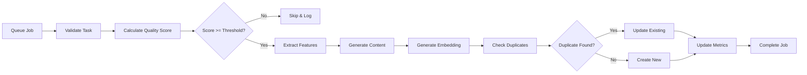
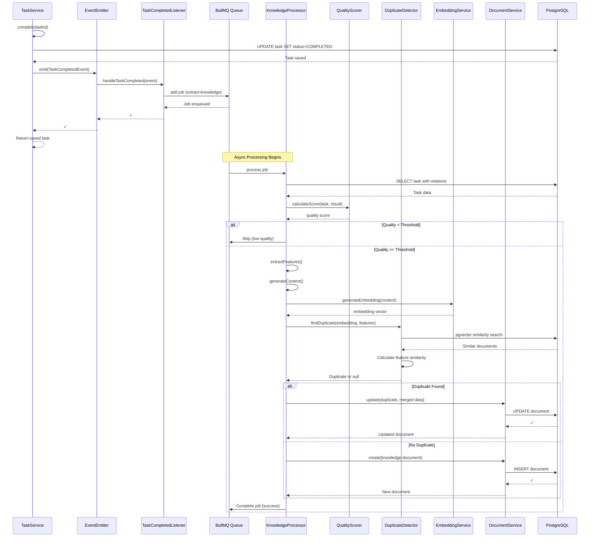
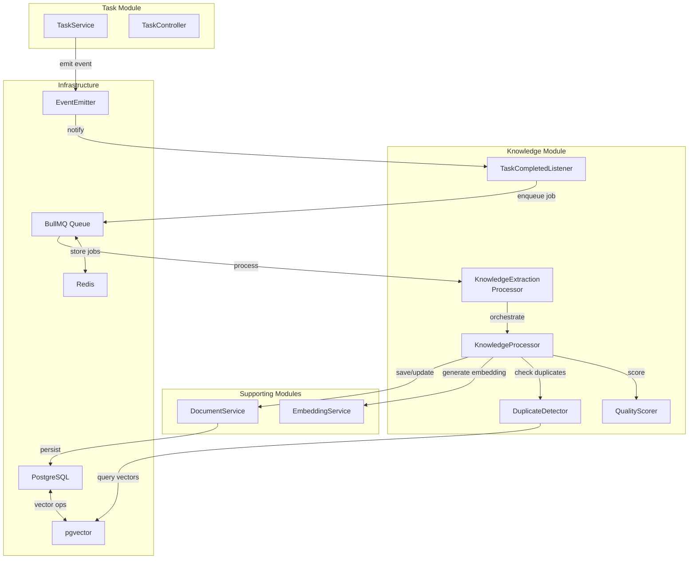

# Knowledge Auto-Save System Architecture

**Version:** 1.0  
**Date:** 2025-12-23  
**Status:** Design Specification

## Table of Contents

1. [Overview](#overview)
2. [System Architecture](#system-architecture)
3. [Event-Driven Architecture](#event-driven-architecture)
4. [Knowledge Extraction Pipeline](#knowledge-extraction-pipeline)
5. [Data Structures](#data-structures)
6. [Duplicate Detection Algorithm](#duplicate-detection-algorithm)
7. [API Contracts](#api-contracts)
8. [Error Handling & Retry Strategy](#error-handling--retry-strategy)
9. [Performance Considerations](#performance-considerations)
10. [Implementation Phases](#implementation-phases)

---

## Overview

### Purpose

The Knowledge Auto-Save System automatically captures, processes, and stores knowledge from completed tasks to build an organizational knowledge base. This system enables AI agents (Hollons) to learn from past experiences and reuse solutions.

### Goals

- **Automatic Capture**: Extract knowledge when tasks complete without manual intervention
- **Asynchronous Processing**: Non-blocking knowledge extraction with resilient error handling
- **Deduplication**: Prevent redundant knowledge documents using similarity detection
- **Quality Control**: Score and filter knowledge based on quality metrics
- **Scalability**: Handle high-volume task completions with queue-based processing

### Non-Goals

- Real-time knowledge retrieval (handled by existing RAG system)
- Manual knowledge curation workflows
- Knowledge versioning (future enhancement)

---

## System Architecture

### High-Level Architecture

```mermaid
graph TB
    subgraph "Task Lifecycle"
        A[Task Service] -->|complete()| B[TaskCompletedEvent]
    end
    
    subgraph "Event Layer"
        B --> C[Event Emitter]
        C --> D[Event Bus]
    end
    
    subgraph "Processing Layer"
        D --> E[BullMQ Queue]
        E --> F[Knowledge Processor]
        F --> G[Quality Scorer]
        F --> H[Duplicate Detector]
    end
    
    subgraph "Storage Layer"
        H -->|unique| I[Document Service]
        I --> J[PostgreSQL]
        I --> K[pgvector embeddings]
    end
    
    subgraph "Monitoring"
        E --> L[Metrics Collector]
        F --> L
        I --> L
    end
```

### Component Responsibilities

| Component | Responsibility | Technology |
|-----------|---------------|------------|
| Task Service | Emit TaskCompletedEvent | NestJS EventEmitter |
| Event Bus | Route events to processors | @nestjs/event-emitter |
| BullMQ Queue | Async job processing with retry | BullMQ + Redis |
| Knowledge Processor | Extract and transform task data | NestJS Service |
| Quality Scorer | Calculate knowledge quality metrics | Custom algorithm |
| Duplicate Detector | Detect similar knowledge entries | Cosine similarity + pgvector |
| Document Service | Persist knowledge documents | TypeORM + PostgreSQL |

---

## Event-Driven Architecture

### TaskCompletedEvent

**Event Structure:**

```typescript
// apps/server/src/modules/task/events/task-completed.event.ts

export class TaskCompletedEvent {
  constructor(
    public readonly taskId: string,
    public readonly task: Task,
    public readonly hollonId: string | null,
    public readonly result: TaskCompletionResult | null,
    public readonly timestamp: Date = new Date(),
  ) {}
}
```

**Event Flow:**

1. **Emission Point**: `TaskService.complete()`
   - Emitted AFTER task status is saved to database
   - Fire-and-forget pattern (non-blocking)
   - Includes full task context + completion result

2. **Event Listeners**:
   - `KnowledgeEventHandler` - Enqueues knowledge extraction job
   - `MetricsEventHandler` - Records completion metrics (future)
   - `NotificationHandler` - Notifies stakeholders (future)

### Event Emitter Configuration

```typescript
// apps/server/src/modules/task/task.module.ts

@Module({
  imports: [
    TypeOrmModule.forFeature([Task, Project]),
    EventEmitterModule.forRoot({
      wildcard: false,
      delimiter: '.',
      newListener: false,
      removeListener: false,
      maxListeners: 10,
      verboseMemoryLeak: true,
      ignoreErrors: false,
    }),
    BullModule.registerQueue({
      name: 'knowledge-extraction',
    }),
  ],
  // ...
})
export class TaskModule {}
```

### Event Handler

```typescript
// apps/server/src/modules/knowledge/listeners/task-completed.listener.ts

@Injectable()
export class TaskCompletedListener {
  constructor(
    @InjectQueue('knowledge-extraction')
    private readonly knowledgeQueue: Queue,
    private readonly logger: Logger,
  ) {}

  @OnEvent('task.completed')
  async handleTaskCompleted(event: TaskCompletedEvent): Promise<void> {
    try {
      // Add job to queue with exponential backoff retry
      await this.knowledgeQueue.add(
        'extract-knowledge',
        {
          taskId: event.taskId,
          hollonId: event.hollonId,
          result: event.result,
          timestamp: event.timestamp,
        },
        {
          attempts: 3,
          backoff: {
            type: 'exponential',
            delay: 2000,
          },
          removeOnComplete: 100, // Keep last 100 completed jobs
          removeOnFail: 500,     // Keep last 500 failed jobs for debugging
        },
      );

      this.logger.log(`Enqueued knowledge extraction for task ${event.taskId}`);
    } catch (error) {
      this.logger.error(
        `Failed to enqueue knowledge extraction for task ${event.taskId}`,
        error.stack,
      );
      // Don't throw - event handling should be resilient
    }
  }
}
```

---

## Knowledge Extraction Pipeline

### Pipeline Stages



### Knowledge Processor Service

```typescript
// apps/server/src/modules/knowledge/services/knowledge-processor.service.ts

@Injectable()
export class KnowledgeProcessorService {
  constructor(
    private readonly taskRepo: Repository<Task>,
    private readonly documentService: DocumentService,
    private readonly qualityScorer: QualityScoreService,
    private readonly duplicateDetector: DuplicateDetectorService,
    private readonly embeddingService: EmbeddingService,
    private readonly logger: Logger,
  ) {}

  async processTask(
    taskId: string,
    hollonId: string | null,
    result: TaskCompletionResult | null,
  ): Promise<ProcessingResult> {
    // Stage 1: Load task with relations
    const task = await this.taskRepo.findOne({
      where: { id: taskId },
      relations: ['dependencies', 'subtasks'],
    });

    if (!task) {
      throw new NotFoundException(`Task ${taskId} not found`);
    }

    // Stage 2: Calculate quality score
    const qualityScore = this.qualityScorer.calculateScore(task, result);

    if (qualityScore < MINIMUM_QUALITY_THRESHOLD) {
      this.logger.debug(
        `Task ${taskId} quality score ${qualityScore} below threshold, skipping`,
      );
      return {
        status: 'skipped',
        reason: 'low_quality',
        score: qualityScore,
      };
    }

    // Stage 3: Extract features & generate content
    const features = this.extractFeatures(task, result);
    const content = this.generateKnowledgeContent(task, result);

    // Stage 4: Generate embedding
    const embedding = await this.embeddingService.generateEmbedding(content);

    // Stage 5: Check for duplicates
    const duplicate = await this.duplicateDetector.findDuplicate(
      embedding,
      features,
      task.organizationId,
    );

    // Stage 6: Create or update document
    if (duplicate) {
      return this.updateExistingKnowledge(duplicate, task, result, qualityScore);
    } else {
      return this.createNewKnowledge(task, result, content, embedding, features, qualityScore);
    }
  }

  private extractFeatures(task: Task, result?: TaskCompletionResult): KnowledgeFeatures {
    return {
      taskType: task.type,
      requiredSkills: task.requiredSkills || [],
      tags: task.tags || [],
      affectedFiles: task.affectedFiles || [],
      filesChanged: result?.filesChanged || [],
      priority: task.priority,
      complexity: task.estimatedComplexity,
      hasTests: result?.testsPassed !== undefined,
      hasPR: !!result?.pullRequestUrl,
    };
  }
}
```

### BullMQ Processor

```typescript
// apps/server/src/modules/knowledge/processors/knowledge-extraction.processor.ts

@Processor('knowledge-extraction')
export class KnowledgeExtractionProcessor {
  constructor(
    private readonly knowledgeProcessor: KnowledgeProcessorService,
    private readonly logger: Logger,
  ) {}

  @Process('extract-knowledge')
  async handleExtraction(job: Job<KnowledgeExtractionJob>): Promise<ProcessingResult> {
    const { taskId, hollonId, result } = job.data;

    this.logger.log(`Processing knowledge extraction for task ${taskId}`);

    try {
      const processingResult = await this.knowledgeProcessor.processTask(
        taskId,
        hollonId,
        result,
      );

      // Update job progress
      await job.updateProgress(100);

      return processingResult;
    } catch (error) {
      this.logger.error(
        `Failed to extract knowledge from task ${taskId}`,
        error.stack,
      );
      throw error; // Will trigger retry
    }
  }

  @OnQueueCompleted()
  onCompleted(job: Job, result: ProcessingResult) {
    this.logger.log(
      `Knowledge extraction completed for task ${job.data.taskId}: ${result.status}`,
    );
  }

  @OnQueueFailed()
  onFailed(job: Job, error: Error) {
    this.logger.error(
      `Knowledge extraction failed for task ${job.data.taskId}`,
      error.stack,
    );
  }
}
```

---

## Data Structures

### Quality Metrics Schema

```typescript
// apps/server/src/modules/knowledge/interfaces/quality-metrics.interface.ts

export interface QualityMetrics {
  // Overall score (0-100)
  overallScore: number;

  // Component scores (0-100 each)
  completenessScore: number;  // Has description, skills, results
  complexityScore: number;    // Based on estimated complexity
  documentationScore: number; // Has acceptance criteria, tags
  verificationScore: number;  // Has tests, PR review
  reusabilityScore: number;   // Generic vs specific solution

  // Metadata
  calculatedAt: Date;
  version: string; // Algorithm version for future improvements
}

export const QUALITY_SCORE_WEIGHTS = {
  completeness: 0.25,
  complexity: 0.20,
  documentation: 0.15,
  verification: 0.25,
  reusability: 0.15,
} as const;

export const MINIMUM_QUALITY_THRESHOLD = 40; // 0-100 scale
```

### Knowledge Features

```typescript
// apps/server/src/modules/knowledge/interfaces/knowledge-features.interface.ts

export interface KnowledgeFeatures {
  // Task metadata
  taskType: TaskType;
  priority: TaskPriority;
  complexity: 'low' | 'medium' | 'high' | null;

  // Skill & technology tags
  requiredSkills: string[];
  tags: string[];

  // Code impact
  affectedFiles: string[];
  filesChanged: string[];

  // Quality indicators
  hasTests: boolean;
  hasPR: boolean;
  hasReviewComments: boolean;

  // Derived features
  fileExtensions?: string[];      // .ts, .js, .py, etc.
  directoryPatterns?: string[];   // src/modules/*, tests/*, etc.
  actionKeywords?: string[];      // fix, refactor, implement, etc.
}
```

### Processing Result

```typescript
// apps/server/src/modules/knowledge/interfaces/processing-result.interface.ts

export interface ProcessingResult {
  status: 'created' | 'updated' | 'skipped' | 'failed';
  reason?: string;
  documentId?: string;
  score?: number;
  similarity?: number; // For duplicates
  error?: string;
}
```

### Queue Job Data

```typescript
// apps/server/src/modules/knowledge/interfaces/queue-job.interface.ts

export interface KnowledgeExtractionJob {
  taskId: string;
  hollonId: string | null;
  result: TaskCompletionResult | null;
  timestamp: Date;
}
```

### Enhanced Document Metadata

```typescript
// apps/server/src/modules/document/interfaces/knowledge-metadata.interface.ts

export interface KnowledgeMetadata extends Record<string, unknown> {
  // Task context
  taskType: TaskType;
  taskId: string;
  priority: TaskPriority;
  completedAt: Date;

  // Execution results
  filesChanged?: string[];
  pullRequestUrl?: string | null;
  testsPassed?: boolean;
  reviewComments?: string[];

  // Quality metrics
  qualityScore: number;
  qualityMetrics: QualityMetrics;

  // Features for similarity matching
  features: KnowledgeFeatures;

  // Duplicate tracking
  isDuplicateOf?: string;        // Document ID if merged
  duplicateCount?: number;        // How many times seen
  lastDuplicateAt?: Date;        // Last time duplicate detected

  // Usage tracking (future)
  accessCount?: number;
  lastAccessedAt?: Date;
}
```

---

## Duplicate Detection Algorithm

### Algorithm Overview

**Strategy:** Hybrid similarity detection combining:
1. **Semantic Similarity**: Cosine similarity on embeddings (pgvector)
2. **Feature Matching**: Jaccard similarity on tags/skills/files
3. **Content Hash**: Exact deduplication for identical content

### Similarity Calculation

```typescript
// apps/server/src/modules/knowledge/services/duplicate-detector.service.ts

@Injectable()
export class DuplicateDetectorService {
  constructor(
    private readonly documentRepo: Repository<Document>,
    private readonly dataSource: DataSource,
  ) {}

  async findDuplicate(
    embedding: number[],
    features: KnowledgeFeatures,
    organizationId: string,
  ): Promise<Document | null> {
    // Step 1: Semantic similarity search (pgvector)
    const semanticCandidates = await this.findSemanticallySimilar(
      embedding,
      organizationId,
      SEMANTIC_SIMILARITY_THRESHOLD,
      10, // top 10 candidates
    );

    if (semanticCandidates.length === 0) {
      return null;
    }

    // Step 2: Feature-based similarity scoring
    const scoredCandidates = semanticCandidates.map((candidate) => {
      const candidateFeatures = (candidate.metadata as KnowledgeMetadata)?.features;
      
      if (!candidateFeatures) {
        return { document: candidate, score: 0 };
      }

      const featureScore = this.calculateFeatureSimilarity(features, candidateFeatures);
      const semanticScore = candidate.similarity; // From pgvector query
      
      // Weighted combination
      const combinedScore = 
        (SEMANTIC_WEIGHT * semanticScore) +
        (FEATURE_WEIGHT * featureScore);

      return { document: candidate, score: combinedScore };
    });

    // Step 3: Find best match above threshold
    const bestMatch = scoredCandidates
      .sort((a, b) => b.score - a.score)
      .find((candidate) => candidate.score >= DUPLICATE_THRESHOLD);

    return bestMatch?.document ?? null;
  }

  private async findSemanticallySimilar(
    embedding: number[],
    organizationId: string,
    threshold: number,
    limit: number,
  ): Promise<Array<Document & { similarity: number }>> {
    // Using pgvector cosine similarity operator (<=>)
    const query = `
      SELECT 
        d.*,
        1 - (d.embedding <=> $1::vector) as similarity
      FROM documents d
      WHERE 
        d.organization_id = $2
        AND d.type = $3
        AND d.embedding IS NOT NULL
        AND 1 - (d.embedding <=> $1::vector) >= $4
      ORDER BY d.embedding <=> $1::vector
      LIMIT $5
    `;

    const results = await this.dataSource.query(query, [
      `[${embedding.join(',')}]`,
      organizationId,
      DocumentType.KNOWLEDGE,
      threshold,
      limit,
    ]);

    return results;
  }

  private calculateFeatureSimilarity(
    features1: KnowledgeFeatures,
    features2: KnowledgeFeatures,
  ): number {
    // Jaccard similarity for set-based features
    const skillSimilarity = this.jaccardSimilarity(
      features1.requiredSkills,
      features2.requiredSkills,
    );

    const tagSimilarity = this.jaccardSimilarity(
      features1.tags,
      features2.tags,
    );

    const fileSimilarity = this.jaccardSimilarity(
      features1.affectedFiles,
      features2.affectedFiles,
    );

    // Exact matches for categorical features
    const typeMatch = features1.taskType === features2.taskType ? 1 : 0;
    const complexityMatch = features1.complexity === features2.complexity ? 1 : 0;

    // Weighted average
    return (
      SKILL_WEIGHT * skillSimilarity +
      TAG_WEIGHT * tagSimilarity +
      FILE_WEIGHT * fileSimilarity +
      TYPE_WEIGHT * typeMatch +
      COMPLEXITY_WEIGHT * complexityMatch
    );
  }

  private jaccardSimilarity(set1: string[], set2: string[]): number {
    if (set1.length === 0 && set2.length === 0) {
      return 1.0;
    }

    const s1 = new Set(set1);
    const s2 = new Set(set2);

    const intersection = new Set([...s1].filter((x) => s2.has(x)));
    const union = new Set([...s1, ...s2]);

    return intersection.size / union.size;
  }
}
```

### Similarity Thresholds

```typescript
// apps/server/src/modules/knowledge/constants/similarity.constants.ts

// Semantic similarity (cosine distance via pgvector)
export const SEMANTIC_SIMILARITY_THRESHOLD = 0.85; // 0-1 scale

// Feature similarity weights (sum to 1.0)
export const SKILL_WEIGHT = 0.30;
export const TAG_WEIGHT = 0.25;
export const FILE_WEIGHT = 0.20;
export const TYPE_WEIGHT = 0.15;
export const COMPLEXITY_WEIGHT = 0.10;

// Combined similarity threshold for duplicate detection
export const DUPLICATE_THRESHOLD = 0.80; // 0-1 scale

// Weighted combination of semantic + feature similarity
export const SEMANTIC_WEIGHT = 0.60;
export const FEATURE_WEIGHT = 0.40;
```

### Duplicate Handling Strategy

**When duplicate is detected:**

1. **Update existing document** (not create new):
   - Increment `metadata.duplicateCount`
   - Update `metadata.lastDuplicateAt`
   - Keep higher quality version of content
   - Merge unique tags/skills
   - Update quality score if improved

2. **Link to original**:
   - Store reference in task's document (via `metadata.isDuplicateOf`)
   - Maintain audit trail

3. **Metrics tracking**:
   - Log duplicate detection rate
   - Monitor threshold effectiveness

---

## API Contracts

### KnowledgeModule Public Interface

```typescript
// apps/server/src/modules/knowledge/knowledge.module.ts

@Module({
  imports: [
    TypeOrmModule.forFeature([Document, Task]),
    BullModule.registerQueue({
      name: 'knowledge-extraction',
    }),
    DocumentModule,
    EmbeddingModule,
  ],
  providers: [
    KnowledgeProcessorService,
    QualityScoreService,
    DuplicateDetectorService,
    TaskCompletedListener,
    KnowledgeExtractionProcessor,
  ],
  exports: [
    KnowledgeProcessorService, // For manual knowledge extraction
  ],
})
export class KnowledgeModule {}
```

### QualityScoreService Interface

```typescript
// apps/server/src/modules/knowledge/services/quality-score.service.ts

@Injectable()
export class QualityScoreService {
  /**
   * Calculate quality score for a completed task
   * @returns Quality score (0-100)
   */
  calculateScore(task: Task, result?: TaskCompletionResult): number;

  /**
   * Get detailed quality metrics breakdown
   */
  calculateMetrics(task: Task, result?: TaskCompletionResult): QualityMetrics;

  /**
   * Determine if task meets minimum quality threshold
   */
  meetsThreshold(task: Task, result?: TaskCompletionResult): boolean;
}
```

### EmbeddingService Interface

```typescript
// apps/server/src/modules/knowledge/services/embedding.service.ts

@Injectable()
export class EmbeddingService {
  /**
   * Generate vector embedding for text content
   * @param content - Text to embed
   * @returns Vector embedding (e.g., 1536 dimensions for OpenAI)
   */
  async generateEmbedding(content: string): Promise<number[]>;

  /**
   * Batch generate embeddings (more efficient)
   */
  async generateEmbeddings(contents: string[]): Promise<number[][]>;
}
```

---

## Error Handling & Retry Strategy

### Error Categories

| Error Type | Retry Strategy | Fallback |
|------------|----------------|----------|
| Transient DB errors | Exponential backoff (3 attempts) | Log and alert |
| Embedding API timeout | Linear backoff (5 attempts) | Skip embedding, save without |
| Validation errors | No retry | Log and skip |
| Queue connection loss | Infinite retry with backoff | Alert ops team |

### Retry Configuration

```typescript
// BullMQ job options
{
  attempts: 3,
  backoff: {
    type: 'exponential',
    delay: 2000, // 2s, 4s, 8s
  },
  removeOnComplete: 100,
  removeOnFail: 500,
}
```

### Dead Letter Queue

Failed jobs after all retries:
- Move to `knowledge-extraction-failed` queue
- Store for manual review
- Alert on threshold (e.g., >10 failures/hour)

### Circuit Breaker

For external services (embedding API):
- Open circuit after 5 consecutive failures
- Half-open after 30 seconds
- Monitor success rate

---

## Performance Considerations

### Scalability Targets

| Metric | Target | Notes |
|--------|--------|-------|
| Task completion throughput | 100/second | Peak load during CI runs |
| Knowledge processing latency | < 5 seconds | P95 for standard tasks |
| Queue depth | < 1000 jobs | Alert if exceeded |
| Duplicate detection | < 500ms | pgvector index required |
| Database writes | < 100ms | P95 for document insert |

### Optimization Strategies

1. **Batch Processing**:
   - Group similar tasks for batch embedding generation
   - Bulk insert documents when possible

2. **Caching**:
   - Cache embeddings for identical content (TTL: 1 hour)
   - Cache quality score calculations (task metadata hash)

3. **Database Indexing**:
   ```sql
   -- GIN index for tag array searches
   CREATE INDEX idx_documents_tags ON documents USING GIN (tags);
   
   -- HNSW index for vector similarity (pgvector)
   CREATE INDEX idx_documents_embedding ON documents 
   USING hnsw (embedding vector_cosine_ops);
   
   -- Composite index for filtering
   CREATE INDEX idx_documents_org_type ON documents (organization_id, type);
   ```

4. **Queue Concurrency**:
   ```typescript
   // Configure worker concurrency
   @Process({ name: 'extract-knowledge', concurrency: 5 })
   ```

5. **Embedding Batching**:
   - Collect tasks over 5-second window
   - Batch embed up to 20 tasks at once
   - 10x reduction in API calls

---

## Implementation Phases

### Phase 1: Foundation (Week 1)

**Goal:** Set up event infrastructure and basic queue processing

- [ ] Install dependencies: `@nestjs/event-emitter`, `@nestjs/bull`, `bullmq`, `ioredis`
- [ ] Create KnowledgeModule with basic structure
- [ ] Implement TaskCompletedEvent class
- [ ] Add EventEmitterModule to TaskModule
- [ ] Emit event in TaskService.complete()
- [ ] Create TaskCompletedListener to enqueue jobs
- [ ] Set up BullMQ queue configuration
- [ ] Create basic KnowledgeExtractionProcessor
- [ ] Add logging and monitoring
- [ ] Write unit tests for event emission

**Deliverables:**
- Events are emitted on task completion
- Jobs are enqueued successfully
- Basic processor handles jobs

### Phase 2: Knowledge Processing (Week 2)

**Goal:** Implement quality scoring and content generation

- [ ] Create QualityScoreService with scoring algorithm
- [ ] Implement quality metrics calculation
- [ ] Define quality thresholds and weights
- [ ] Enhance KnowledgeProcessorService with feature extraction
- [ ] Reuse existing generateKnowledgeContent() logic
- [ ] Add quality filtering to processor
- [ ] Create KnowledgeFeatures extraction
- [ ] Add comprehensive logging
- [ ] Write unit tests for quality scoring
- [ ] Integration tests for end-to-end processing

**Deliverables:**
- Quality scoring works correctly
- Low-quality tasks are filtered out
- Features are extracted properly

### Phase 3: Duplicate Detection (Week 3)

**Goal:** Implement embedding-based duplicate detection

- [ ] Create EmbeddingService (integrate with existing AI provider)
- [ ] Generate embeddings for knowledge content
- [ ] Store embeddings in Document.embedding field
- [ ] Create pgvector migration for vector type
- [ ] Add HNSW index for similarity search
- [ ] Implement DuplicateDetectorService
- [ ] Write semantic similarity query (pgvector)
- [ ] Implement feature-based similarity calculation
- [ ] Add duplicate handling logic (update vs create)
- [ ] Write tests for duplicate detection

**Deliverables:**
- Embeddings are generated and stored
- Duplicates are detected accurately
- Similar knowledge is merged/updated

### Phase 4: Production Readiness (Week 4)

**Goal:** Error handling, monitoring, and optimization

- [ ] Implement retry strategies with exponential backoff
- [ ] Add dead letter queue handling
- [ ] Create circuit breaker for embedding API
- [ ] Add comprehensive error logging
- [ ] Implement metrics collection (Prometheus)
- [ ] Create monitoring dashboards
- [ ] Add database indexes for performance
- [ ] Optimize queue concurrency settings
- [ ] Load testing and performance tuning
- [ ] Documentation and runbook

**Deliverables:**
- System handles errors gracefully
- Monitoring and alerting in place
- Performance meets targets
- Production deployment ready

---

## Component Diagrams

### Sequence Diagram: Knowledge Auto-Save Flow



### Component Interaction Diagram



---

## Appendix

### Related Documents

- [Phase 3 Plan](../phases/phase3-plan.md) - Context on knowledge system
- [Phase 4 Plan](../phases/phase4-revised-plan.md) - CI/CD integration
- [Document Entity](../../apps/server/src/modules/document/entities/document.entity.ts)
- [Task Entity](../../apps/server/src/modules/task/entities/task.entity.ts)

### Future Enhancements

1. **Knowledge Versioning**: Track changes to knowledge over time
2. **Smart Merging**: LLM-powered merging of duplicate knowledge
3. **Quality Feedback Loop**: Learn from knowledge usage to improve scoring
4. **Batch Reprocessing**: Retroactively process historical tasks
5. **Knowledge Clustering**: Automatically group related knowledge
6. **Multi-language Support**: Extract knowledge from non-English tasks

### Configuration Reference

```typescript
// Environment variables
REDIS_HOST=localhost
REDIS_PORT=6379
KNOWLEDGE_QUEUE_CONCURRENCY=5
KNOWLEDGE_MIN_QUALITY_THRESHOLD=40
DUPLICATE_SIMILARITY_THRESHOLD=0.80
EMBEDDING_MODEL=text-embedding-3-small
EMBEDDING_BATCH_SIZE=20
```

---

**Document End**
