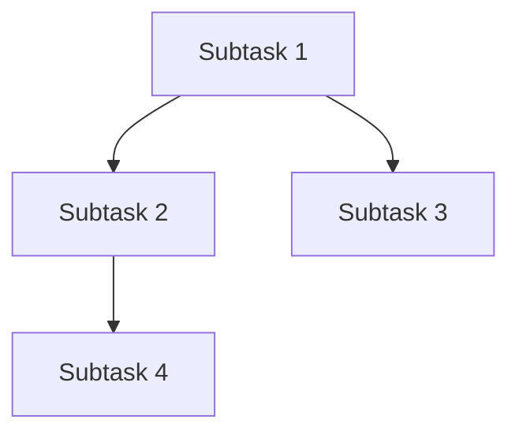

# Planning Workflow Design

## Overview

Goal이 Team Epic으로 분해된 후, 바로 Implementation Task로 분해하지 않고 **Planning Phase**를 거칩니다.
Planning Phase에서 사람의 리뷰를 받은 후에만 구현 태스크로 분해됩니다.

## Workflow Diagram

```
Goal (active)
     │
     ▼ [CTO decomposes]
Team Epic (pending, needs_planning=true)
     │
     ▼ [autoCreatePlanningTasks cron]
Planning Task (type=planning, in_progress)
     │
     ├─ PlanningSpecialist 서브홀론 생성
     ├─ 팀장 워크트리에서 계획 문서 작성
     │   └─ docs/teams/{team-name}/plans/{epic-id}-plan.md
     ├─ PR 생성
     │
     ▼ [autoCheckPlanningPRs cron]
PR Status Check
     │
     ├─ CHANGES_REQUESTED → 계획 수정 재실행
     ├─ APPROVED → Team Epic.status = READY, Planning Task = COMPLETED
     │
     ▼ [autoDecomposeTeamEpics cron - existing]
Implementation Tasks (pending, needs_planning=true) ← 선택적
     │
     ▼ [같은 Planning Phase 반복]
     │
     ▼ [Plan approved]
Implementation Tasks (ready)
     │
     ▼ [autoExecuteTasks - existing]
Execution...
```

## Data Model Changes

### Task Entity Changes

```typescript
// task.entity.ts에 추가
@Column({ name: 'needs_planning', default: false })
needsPlanning: boolean;

@Column({ name: 'planning_task_id', type: 'uuid', nullable: true })
planningTaskId: string | null;  // 이 태스크의 계획을 담당하는 Planning Task

@Column({ name: 'plan_document_path', type: 'text', nullable: true })
planDocumentPath: string | null;  // docs/teams/.../plan.md 경로
```

### Task Metadata

```typescript
metadata: {
  planningStatus: 'needs_planning' | 'planning_in_progress' | 'plan_approved' | 'plan_rejected',
  planPrUrl: string,
  planPrNumber: number,
  planApprovedAt: Date,
  planReviewComments: string[],
}
```

## New Components

### 1. PlanningService

```typescript
// apps/server/src/modules/planning/planning.service.ts
@Injectable()
export class PlanningService {
  // Planning Task 생성
  async createPlanningTask(parentTask: Task): Promise<Task>;

  // 계획 문서 작성 (Brain Provider 호출)
  async generatePlan(planningTask: Task): Promise<string>;

  // PR 생성
  async createPlanningPR(planningTask: Task, planPath: string): Promise<string>;

  // PR 리뷰 상태 확인 및 처리
  async handlePlanningPRReview(planningTask: Task): Promise<void>;

  // 계획 수정 (리뷰 코멘트 반영)
  async revisePlan(planningTask: Task, comments: string[]): Promise<void>;
}
```

### 2. New Cron Jobs

```typescript
// goal-automation.listener.ts에 추가

@Cron('*/1 * * * *')
async autoCreatePlanningTasks(): Promise<void>
// needs_planning=true인 태스크에 대해 Planning Task 생성

@Cron('*/1 * * * *')
async autoCheckPlanningPRs(): Promise<void>
// Planning PR 상태 확인 및 승인/거절 처리
```

## Plan Document Structure

### Location

```
docs/
└── teams/
    ├── backend-engineering/
    │   └── plans/
    │       ├── epic-{uuid}-knowledge-system.md
    │       └── task-{uuid}-vector-service.md
    ├── data-ai-engineering/
    │   └── plans/
    │       └── ...
    └── backend-infrastructure/
        └── plans/
            └── ...
```

### Plan Document Template

````markdown
# Plan: {Task Title}

## Task Information

- **Task ID**: {uuid}
- **Type**: {team_epic | implementation}
- **Assigned To**: {Team or Hollon name}
- **Parent**: {parent task title if any}

## Objective

{Goal/Task description}

## Analysis

### Codebase Impact

- **Files to create**:
- **Files to modify**:
- **Dependencies affected**:

### Technical Approach

{Detailed implementation approach}

### Risks and Mitigations

| Risk | Mitigation |
| ---- | ---------- |
| ...  | ...        |

## Decomposition (for Team Epics)

### Subtasks

1. **{Subtask 1 Title}**
   - Assignee: {Hollon name}
   - Description: ...
   - Acceptance Criteria: ...

2. **{Subtask 2 Title}**
   - ...

### Dependencies


````

## Success Criteria

- [ ] Criterion 1
- [ ] Criterion 2

## Timeline Estimate

{Not time-based, but complexity/dependency order}

---

_Generated by: {Hollon name}_
_Date: {timestamp}_
_Status: PENDING_REVIEW_

```

## PR Format for Plans

### PR Title
```

[Plan] {Task Type}: {Task Title}

````

### PR Body
```markdown
## Planning PR

This PR contains the implementation plan for: **{Task Title}**

### Plan Location
`docs/teams/{team}/plans/{task-id}-plan.md`

### Review Checklist
- [ ] Technical approach is sound
- [ ] Subtask decomposition is appropriate
- [ ] Dependencies are correctly identified
- [ ] Risk mitigations are adequate

### Actions
- **Approve**: Plan will be executed, subtasks will be created
- **Request Changes**: Plan will be revised based on your feedback

---
*Auto-generated by Hollon Planning System*
````

## Configuration

### Enable/Disable Planning per Task Type

```typescript
// Organization settings or environment config
PLANNING_REQUIRED_FOR_TEAM_EPICS = true;
PLANNING_REQUIRED_FOR_IMPLEMENTATION_TASKS = false; // 선택적
PLANNING_AUTO_APPROVE_TIMEOUT_HOURS = 24; // 자동 승인 타임아웃 (선택적)
```

## Implementation Steps

1. **Phase 1: Data Model**
   - Add `needsPlanning`, `planningTaskId`, `planDocumentPath` to Task entity
   - Add migration

2. **Phase 2: PlanningService**
   - Create planning.module.ts, planning.service.ts
   - Implement plan generation logic (Brain Provider)
   - Implement PR creation/tracking

3. **Phase 3: Cron Integration**
   - Add `autoCreatePlanningTasks` cron
   - Add `autoCheckPlanningPRs` cron
   - Modify `autoDecomposeTeamEpics` to check plan approval

4. **Phase 4: Hollon Prompts**
   - Update CTO prompt for planning awareness
   - Update Team Lead prompts
   - Create PlanningSpecialist prompt

5. **Phase 5: Testing**
   - Create test Goal
   - Verify planning workflow
   - Test PR review → revision cycle

## Human Review Interface

사람은 다음과 같이 리뷰합니다:

1. **GitHub PR 확인**
   - Planning PR이 생성되면 알림
   - `docs/teams/.../plans/` 경로의 계획 문서 확인

2. **리뷰 옵션**
   - **Approve**: PR 승인 → 구현 진행
   - **Request Changes**: 코멘트 작성 → 계획 수정

3. **코멘트 방식**
   - PR 코멘트로 피드백 작성
   - 시스템이 코멘트를 읽고 계획 수정 후 재PR

---

_Last Updated: 2026-01-08_
